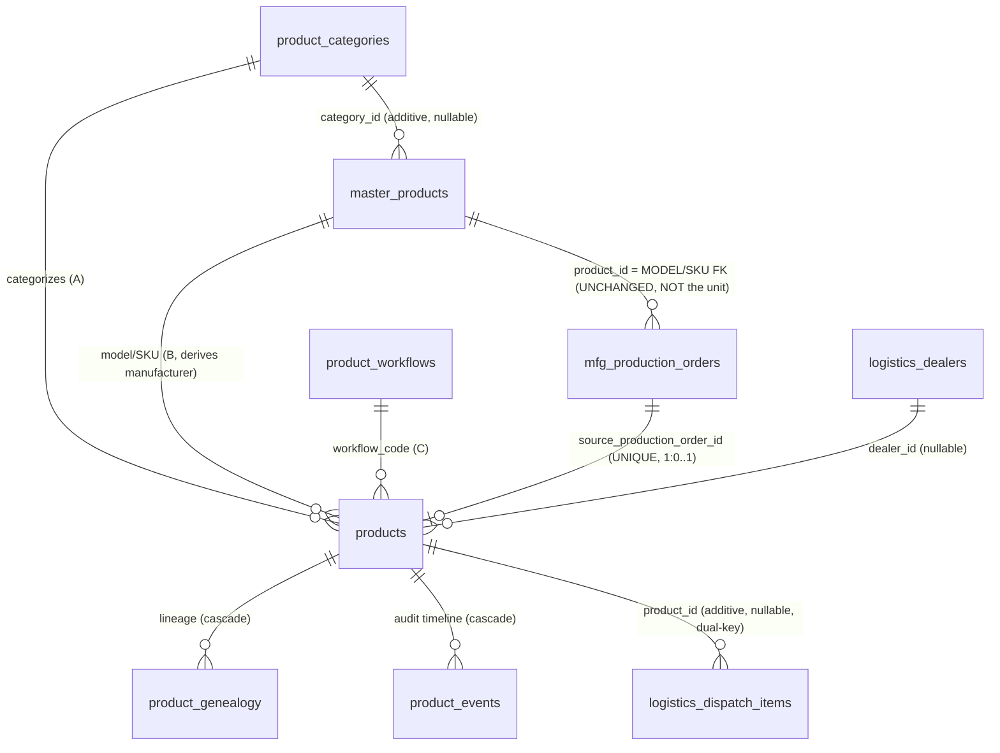

# CW-03 Phase 0 — Product Platform Foundation Review

**Status:** Verification deliverable (no implementation beyond the approved DB foundation).
**Date:** 2026-06-28 · **Scope:** Unified Product Platform v1.0 — Phase 0 (additive schema + seeds only).
**Method:** Every statement below is verified against the live schema (`drizzle-kit push` applied),
the seeded rows (queried), and the frozen plan (`CW-03_IMPLEMENTATION_PLAN.md` §2.1–§14). _Do not
assume. Measure. Verify. Document._

> **Verification basis (measured):** `typecheck:libs` clean · schema pushed · api-server boots
> (`/api/healthz` → 200) · seeds confirmed in DB (3 categories, 3 workflows, BATTERY active w/ 9-stage
> sequence) · `products.model_id / category_id / workflow_code / official_product_serial` = `NOT NULL`,
> `source_production_order_id` = `UNIQUE` nullable (information_schema confirmed).

---

## 1. Database Verification — ERD

### 1.1 New Product Platform tables (as built)

| Table | Key columns | Notable constraints |
|-------|-------------|---------------------|
| `product_categories` (A — Category master) | master-common: `id`, `code` (UNIQUE), `name`, `status`, revision/timestamps | seeded: BATTERY_PACK (active), INBUILT_LITHIUM_INVERTER (inactive), HYBRID_INVERTER (inactive) |
| `product_workflows` (C — Workflow master) | master-common + `stage_sequence` (jsonb `string[]`) | seeded: BATTERY (active, 9 stages); INBUILT_LITHIUM / HYBRID (inactive, empty sequence) |
| `products` (D — serialized **unit**) | `id`, `category_id`→cat, `model_id`→master_products, `workflow_code`→workflow, `source_production_order_id`→order, `official_product_serial`, `serial_source`, `qc_status`, `product_status`, `current_location`, `dealer_id`→dealer | `model_id`/`category_id`/`workflow_code`/`official_product_serial` **NOT NULL**; `source_production_order_id` **UNIQUE** (nullable); `official_product_serial` **UNIQUE** |
| `product_genealogy` (lineage) | `id`, `product_id`→products, `component_type`, `component_id`, `component_name`, `quantity`, `serial_number`, `notes` | `product_id` **NOT NULL**, `ON DELETE CASCADE` |
| `product_events` (append-only audit timeline) | `id`, `product_id`→products, `event_type`, `actor`, `description`, `metadata` (jsonb) | `product_id` **NOT NULL**, `ON DELETE CASCADE`; never updated/deleted by app routes (SS-03 intent) |

Enums: `product_serial_source` = `{OCS, MANUFACTURER}`; `product_status` =
`{manufacturing, qc_passed, ready_for_packing, packed, dispatched, delivered_to_dealer}` (default `qc_passed`).

### 1.2 Relationships (ERD)



**Identity contract made explicit in the ERD:**
- `mfg_production_orders.product_id` → **`master_products`** = the **Model/SKU** of the order. It is
  **never repurposed** for the serialized unit.
- The order ↔ serialized-unit link is **one-directional**: `products.source_production_order_id` →
  `mfg_production_orders` (product → order). UNIQUE ⇒ at most one Product per order ⇒ idempotent emit.
- Manufacturer is **derived** (`products.model_id → master_products.manufacturer*`); there is **no
  brand/manufacturer column** on `products`.

---

## 2. Product Creation Flow — where each table is written

```
Receiving  →  Matching  →  Assembly → Compression → BMS → Charging → Testing  →  QC PASS  →  Packing  →  Dispatch  →  Dealer
   │            │              │  (manufacturing stages, unchanged)        │          │  ★         │           │          │
   ▼            ▼              ▼                                           ▼          ▼            ▼           ▼          ▼
 cell_lots   cell_matches   mfg_order_stages                         (no product   PRODUCT      product_     dispatch   products
 cells       (CW-02)        mfg_battery_genealogy                     write yet)    CREATION     status       _items     .dealer_id
 (CW-02)                    mfg_battery_timeline / test_results                     (★ gate)     transition   .product_id  + status
```

| Stage | Tables written | Product tables touched? | Built in CW-03? |
|-------|----------------|--------------------------|------------------|
| Receiving | `cell_lots`, `cells`, `cell_lot_events` | No | (CW-02 certified) |
| Matching | `cell_matches` | No | (CW-02 certified) |
| Assembly → Testing | `mfg_order_stages`, `mfg_battery_genealogy`, `mfg_battery_timeline`, `mfg_test_results` | No | unchanged (byte-identical) |
| **QC PASS** (`quality_control` approved) | `mfg_qc_approvals`, `mfg_battery_timeline` **+ `products` (INSERT 1)** **+ `product_events` (baseline)** **+ `product_genealogy` (lineage)** | **Yes — the single creation gate** | **Yes (Phase 2 emit hook)** |
| Packing | `mfg_order_stages` (packing stage) → `products.product_status` | status transition only | route exists (`POST /products/{id}/status`); auto-write from packing flow = future (UPP P4) |
| Dispatch | `logistics_dispatch_items.product_id` (dual-key) → `products.product_status` | dual-key set | dual-key column ready; downstream auto-repoint = future (UPP P4) |
| Dealer | `products.dealer_id`, `products.product_status` | yes | status route ready; dealer-flow auto-write = future |

**Permanent rule (enforced by design):** *No Product before QC PASS.* WIP lives only in `mfg_*`;
the `products` row is created at exactly one gate.

> **⚑ Design point to confirm before emit/backfill (flagged, not assumed) — DP-1 genealogy:**
> `product_genealogy` is the generalization of `mfg_battery_genealogy`. At QC-pass the emit should
> **copy** the order's `mfg_battery_genealogy` rows into `product_genealogy` (so the Product owns its
> lineage), vs. having `GET /products/{id}/genealogy` read through `source_production_order_id`.
> Recommendation: **copy at emit** (Product is the canonical identity). Needs CTO confirmation.

---

## 3. Serial Number Flow — per category

One authoritative `official_product_serial` (UNIQUE, global namespace) + `serial_source` provenance.
Downstream consumers use **only** `official_product_serial` and never inspect `serial_source`.

| Category | `serial_source` | Generation | Example | CW-03 |
|----------|-----------------|------------|---------|-------|
| **Battery Pack** | `OCS` | OCS-generated. Reuses the existing `mfg_battery_seq` pattern: `BAT-YYYYMMDD-NNNNNN` (`nextval('mfg_battery_seq')`, 6-digit zero-pad). | `BAT-20260628-000042` | **Exercised** |
| **Inbuilt Lithium Inverter** | `OCS` | OCS-generated **only if** no manufacturer serial exists (imported PCB + OCS pack). Same OCS pattern. | `BAT-`-style OCS serial (format TBD per inverter wave) | Reserved (not built) |
| **Hybrid Inverter** | `MANUFACTURER` | **Reuses the Techfine manufacturer serial** — validated *present + unique*, **never auto-generated**. | e.g. `TF-HY-2026-XXXXX` (manufacturer-supplied) | Reserved (not built) |

> **⚑ DP-2 serial reuse (flagged):** A battery order already carries `mfg_production_orders.battery_number`
> = `BAT-YYYYMMDD-NNNNNN`, assigned at order creation. To avoid drawing a *second* sequence value at QC
> pass (which would diverge from the number the unit carried through manufacturing), the emit should set
> `official_product_serial = order.battery_number`. Recommendation: **reuse `battery_number`** (no fresh
> draw); backfill does the same. Needs CTO confirmation.

---

## 4. Product Identity Verification

| Concept | Table | Role | Verified |
|---------|-------|------|----------|
| **Product Model (SKU)** | `master_products` | Blueprint (chemistry/voltage/capacity/config + FKs). **Never serialized.** | ✅ Unchanged; `mfg_production_orders.product_id` still points here. |
| **Manufacturing Order** | `mfg_production_orders` | The work order / WIP. Carries `battery_number`, stages, genealogy, timeline. | ✅ Unchanged; remains the order, not the finished identity. |
| **Serialized finished Product** | `products` | The unit identity every downstream module references after QC. | ✅ New table; `official_product_serial` UNIQUE. |
| **Created once, only after QC PASS** | — | `source_production_order_id` UNIQUE ⇒ at most one Product per order; emit runs inside the QC-approval tx; re-approval/retry cannot duplicate. | ✅ Constraint in place (DB-enforced); emit hook is Phase 2 work. |

**No identity collision:** Model (`master_products`) ≠ Order (`mfg_production_orders`) ≠ Unit
(`products`). The previously-flagged `product_id` naming collision (C3-R1) is resolved at the DB level —
the order→unit link is exclusively `products.source_production_order_id`.

---

## 5. Genealogy Verification

`product_genealogy` is keyed by `product_id`, category-aware via free-form `component_type`.

**Battery Pack** (CW-03 — exercised):
```
product_genealogy (product_id = P)
  component_type=cell     × N   (serial_number per cell, component_id → cells)
  component_type=bms      × 1   (serial_number, component_id → master_bms unit)
  component_type=cabinet  × 1
  component_type=busbar   × k
  component_type=cable / connector …
```

**Inbuilt Lithium Inverter** (reserved — not built):
```
product_genealogy
  component_type=pcb           × 1   (imported PCB, manufacturer serial)
  component_type=battery_pack  × 1   (OCS 4S1P / 8S1P pack — battery IS part of genealogy)
  component_type=bms           × 1
```

**Hybrid Inverter** (reserved — not built):
```
product_genealogy
  component_type=inverter_unit × 1   (Techfine, MANUFACTURER serial)
  -- NO battery component
```

✅ **Hybrid Inverter has NO battery genealogy** — confirmed against the frozen scope guardrail
(Hybrid = imported inverter, no OCS battery pack). Only Battery genealogy is actually written in CW-03;
Inbuilt/Hybrid are reserved data only. (See **DP-1**: copy-at-emit vs read-through.)

---

## 6. Migration Verification

**Existing Manufacturing Orders keep working unchanged.** All changes are additive; no certified table
was renamed or had a column removed (verified). Orders continue to use `battery_number`, stages,
genealogy and timeline exactly as before. The only behavioural addition is the QC-pass emit hook
(Phase 2), which is a *superset* — it adds a side effect without changing the existing approval contract.

### Every dual-key / temporary relationship

| # | Location | Authoritative key (today) | Additive key (new) | When the temporary side is removed |
|---|----------|---------------------------|--------------------|-------------------------------------|
| DK-1 | `logistics_dispatch_items` | `production_order_id` (UNIQUE) — **authoritative through CW-03** | `product_id` → `products` (nullable) | Downstream **repoints to `product_id`** in **UPP Phase 4**; `production_order_id` retired at **UPP Phase 5** (legacy removal) |
| DK-2 | `master_products` | `category` (existing free-text) | `category_id` → `product_categories` (nullable) | Free-text `category` retired **post-CW-03 certification** once `category_id` is backfilled & verified |

**Not a dual-key (clarification):** `mfg_production_orders.product_id` is the **permanent Model/SKU FK** —
it is *not* temporary and is *not* repointed. The order↔unit link (`products.source_production_order_id`)
is the single canonical link, not a migration artifact.

---

## 7. API Impact

### 7.1 Endpoints that CHANGE (1)

| Endpoint | Change | Backward compatible? |
|----------|--------|----------------------|
| `POST /api/manufacturing/orders/{id}/qc-approval` | Adds the QC-pass **Product emit** inside the existing approval transaction (insert `products` + `product_events` + `product_genealogy`, set `source_production_order_id`). Existing request/response contract unchanged. | ✅ Yes — additive side effect only |

### 7.2 New endpoints

| Endpoint | Purpose |
|----------|---------|
| `GET /api/products` | list (filter/paginate) |
| `GET /api/products/{id}` | detail |
| `GET /api/products/{id}/genealogy` | lineage |
| `POST /api/products/{id}/status` | guarded status transition (RBAC + state-machine, `FOR UPDATE`) |
| `GET /api/masters/product-categories` (+ director write) | category master read/manage |
| `GET /api/masters/product-workflows` (+ director write) | workflow master read/manage |

All authored **OpenAPI-spec-first**, then `pnpm --filter @workspace/api-spec run codegen` regenerates
hooks + Zod (no manual client edits). Each files SS-01 / joins SS-02 matrix × 5 principals / SS-04 config.

### 7.3 Contracts that remain 100% backward compatible

Everything except §7.1: all cell-grading/matching, manufacturing stage lifecycle (start/pause/resume/
complete/approve/reject), charger, rework, testing, genealogy, timeline, **all logistics** (dispatch
still keyed on `production_order_id`), masters, reports, dashboards, auth, developer dashboards. The new
nullable `product_id` / `category_id` columns are invisible to existing reads.

---

## 8. Frontend Impact

| Type | Page(s) |
|------|---------|
| **New pages** | Product List, Product Detail (with genealogy panel); optional Category/Workflow master management (director). All built from existing **ODS** components — no new UI pattern. |
| **Changed pages** | **None for operators.** Manufacturing stage cards / Battery Workspace / dashboards are **byte-identical**. |
| **Future (NOT CW-03)** | Director Dashboard / Reports / Packing / Dispatch gaining Product-aware reads → UPP Phase 4 downstream waves. |

✅ **No existing certified operator workflow changes.** Operators see the same stage UX; the Product
surface is additive (new read-only views + director-managed masters).

---

## 9. Certification Impact

- **CW-03 now certifies the *Product-based* Manufacturing module** — the existing manufacturing surface
  **plus** the Product list/detail/genealogy, the QC-gate emit, status transitions, serial uniqueness,
  dual-key dispatch integrity, and backfill correctness.
- **MAT phases affected — all six** gain Product coverage (per plan §6.1): MAT-01 (Product pages), MAT-02
  (Product read-CRUD + status + masters + RBAC), **MAT-03** (QC-gate → exactly one Product / idempotency,
  serial uniqueness, dual-key integrity, genealogy, TOCTOU under `FOR UPDATE`, **backfill correctness**),
  MAT-04 (up/downstream agreement on the Product handle), MAT-05 (P95 incl. Product endpoints + emit),
  MAT-06 (SS-02/03/04 incl. every product endpoint; **QC-pass-creation audit verified regardless of the
  SS-03 option**).
- **SS-03 path = Option B** (documented MAT-06 audit evidence + backlog the matrix extension; D3 resolved,
  owner = main agent, target = MAT-06). `product_events` / `mfg_battery_timeline` are not added to the
  SS-03 harness unless MAT-06 surfaces a High/security gap.
- **CW-01 / CW-02 do NOT need re-certification.** No certified table was renamed/removed; cell-grading and
  matching logic is untouched. Their standing regression gates (**SS-02 authz**, **SS-03 audit**, **SS-04
  config**) re-run as part of CW-03 and must stay green — the SS-02 matrix and SS-04 checks simply gain
  **additive rows** for the new endpoints/config.

---

## 10. Final Readiness Assessment

### 10.1 Foundation status (verified — DONE)

| Item | Status |
|------|--------|
| New tables created & pushed (`product_categories`, `product_workflows`, `products`, `product_genealogy`, `product_events`) | ✅ |
| Enums (`product_serial_source`, `product_status`) | ✅ |
| Additive nullable columns (`master_products.category_id`, `logistics_dispatch_items.product_id`) — no certified table broken | ✅ |
| Identity constraints (`model_id`/`category_id`/`workflow_code`/`official_product_serial` NOT NULL; `source_production_order_id` UNIQUE; `official_product_serial` UNIQUE) | ✅ |
| Masters seeded (3 categories; 3 workflows; BATTERY active w/ 9-stage sequence; reserved rows inactive) | ✅ |
| `typecheck:libs` clean · api-server boots (healthz 200) · circular `products`↔`logistics` import safe | ✅ |
| Architect review (model_id NOT NULL fix applied) — contract-aligned, additive-safe | ✅ |

### 10.2 Readiness gates for the next work

| Ready for… | Ready? | Blockers / preconditions |
|------------|--------|--------------------------|
| **Backfill** | ⚠ Ready pending DP-1 & DP-2 | Confirm **DP-2** (reuse `battery_number` as `official_product_serial`) and **DP-1** (copy genealogy at emit). Backfill must be idempotent + skip-and-report any model-less order + emit reconciliation count. |
| **API implementation** | ✅ Ready | OpenAPI-spec-first → codegen; SS-01 rows + SS-02 matrix entries authored alongside. |
| **UI implementation** | ✅ Ready | ODS-only Product views; no new pattern. |
| **Manufacturing integration (QC-pass emit)** | ⚠ Ready pending DP-1/DP-2 + D-ECF | Emit inside the approval tx (atomic + idempotent on `source_production_order_id`). **DP-3 (ECF baseline):** decide whether Product *creation* writes an ECF `recordOriginal` baseline (plan §8 flags this; CW-03 builds creation not correction, so ECF is otherwise not triggered). |

### 10.3 Open design points to confirm at this gate (flagged, not assumed)

- **DP-1 — Genealogy:** copy `mfg_battery_genealogy` → `product_genealogy` at emit (recommended) vs read-through.
- **DP-2 — Serial:** `official_product_serial = order.battery_number` (recommended; no second sequence draw) vs fresh `nextval`.
- **DP-3 — ECF baseline:** does QC-pass Product creation write an ECF `recordOriginal` baseline, or is ECF reserved entirely for future Product *corrections*?

### 10.4 Recommendation

The Phase 0 database foundation is **complete, verified, additive-safe, and architect-approved**, and is
**ready to proceed** to backfill + API + UI + QC-pass integration **once DP-1, DP-2, and DP-3 are
confirmed**. No implementation beyond the approved DB foundation has begun, per the gate in plan §13.

---

*Prepared per user standard: "Do not assume. Measure. Verify. Document." All facts measured against the
live schema, seeded data, and frozen plan on 2026-06-28.*
