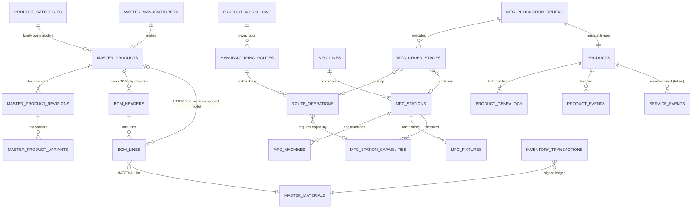
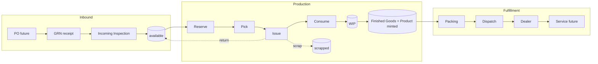
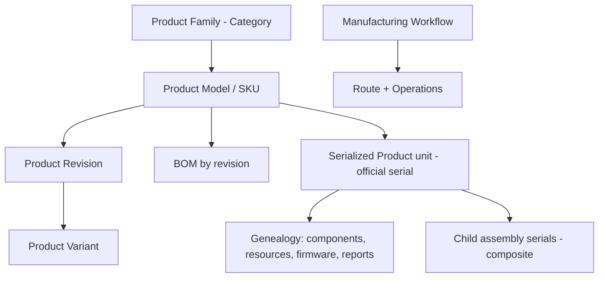

# OCS One — Manufacturing Model Architecture (Phase 4 Design)

**Status:** Design / planning only. **No code, no schema, no migration, no API.** Awaiting
CTO approval before any implementation. This document defines the *complete, generic,
reusable* Manufacturing Model for OCS One so it supports **every current and future
product family** without redesign.

**Product families in scope**

| Family | Today | This design |
|---|---|---|
| Lithium Battery Packs | manufactured (battery stages exist) | first-class |
| Hybrid Solar Inverters | not yet | first-class |
| Inbuilt Lithium Battery Inverters | not yet | first-class (composite) |
| EV Chargers | future | first-class (reserved) |
| ESS / Energy Storage Systems | future | first-class (reserved) |

> Companion documents (consumed, not restated): `unified-product-platform-review.md`
> (the FROZEN v1.0 Product Platform), `mes-master-architecture-flow.md` (the end-to-end
> material→battery flow + signed-ledger rules), `engineering-correction-framework.md`
> (the frozen correction ledger). This document extends those; it never contradicts them.

## Legend

- 🧊 **FROZEN** — exists today; must NOT be modified, renamed, or removed.
- 🟢 **ADDITIVE** — extends a frozen table via **new columns** or a frozen enum via **new
  values** only (never renaming existing ones).
- 🆕 **NEW** — a proposed new table/module (purely additive to the schema).
- 🔵 **DATA** — new master-data rows in an existing frozen table (no schema change).

**Governing rule (from the Product Platform freeze):** this is a *forward architecture*
for future phases. Nothing here is built during the active certification/commercial-
readiness window; each capability lands as a phased, additive change only after CTO
approval. The design guarantees every future module is *additive* — no frozen contract
is ever broken.

---

## 0. Grounding — what exists today vs. what this design adds

**Exists (🧊 FROZEN):**

- **Product Platform v1.0** (4 orthogonal masters): `product_categories` (Category),
  `master_products` (Model/SKU), `product_workflows` (Manufacturing Workflow, with
  `product_creation_trigger`), `products` (serialized unit, `official_product_serial` +
  `serial_source`).
- **Manufacturing execution:** `mfg_production_orders`, `mfg_order_stages`
  (`mfg_stage_type` enum: cell_allocation → assembly → compression → bms_allocation →
  bms_programming → charging → testing → quality_control → packing), `mfg_test_results`,
  `mfg_qc_approvals`, `mfg_rework_tickets`, `mfg_battery_genealogy`, `mfg_battery_timeline`.
- **BOM (Phase 1):** `bom_headers` (owned by Model, revision-controlled draft→approved→
  obsolete) + `bom_lines` (single-level: line → **material** only).
- **Inventory:** the single signed ledger `inventory_transactions`
  (`inventory_transaction_type`, `inventory_stock_state`), GRN + Incoming Inspection.
- **Genealogy of finished units:** `product_genealogy`, `product_events`.
- **Correction ledger:** `engineering_corrections` (ECF); `ecf_entity_type` **already
  reserves** `INVERTER`, `SOLAR_SYSTEM`, `EV_CHARGER`, `BMS`, `CABINET`, `RAW_MATERIAL`.

**Does NOT exist yet (this design proposes, all additive):**

- Manufacturer master (`master_manufacturers`) — 🆕.
- Product **Revision** and **Variant** as first-class concepts — 🟢/🆕.
- **Multi-level** BOM (a line that references a sub-assembly Model, not just a material) — 🟢.
- **Configurable routing** as data (routes/operations owned by Model/Workflow) rather than
  the fixed `mfg_stage_type` enum — 🆕.
- **Workstations** (lines, stations, machines, fixtures, capability) — 🆕.
- Expanded **genealogy** attributes (machine, station, fixture, firmware, revisions,
  report links) — 🟢.
- Expanded **material-flow** states (reserved/picked/issued/consumed/wip/finished_goods/
  returned/scrapped) — 🟢 (additive enum values on the **one** ledger).
- **Service** layer (warranty/AMC/repair/component replacement) — 🆕 (future).

---

## 1. Product Model

Four layers of identity, three of which already exist. Ownership flows top-down; the
serialized unit at the bottom is the single downstream reference.

| Concept | Definition | Home | State |
|---|---|---|---|
| **Product Family** | Broadest grouping of like products (Battery Pack, Hybrid Inverter, Inbuilt Lithium Inverter, EV Charger, ESS). Drives which *route archetype* and *serial policy* apply. | `product_categories` | 🧊 table; 🔵 add EV Charger + ESS rows |
| **Product Model / SKU** | A specific sellable/buildable design within a Family (e.g. "Hybrid 5kW 48V", "48V 100Ah Pack"). The costing/BOM/route owner. Never serialized. | `master_products` | 🧊; 🟢 add `family_id`, `manufacturer_id` |
| **Product Revision** | An engineering version of a Model. Design changes create a new Revision; old Revisions persist for genealogy. | `master_product_revisions` | 🆕 |
| **Product Variant** | A configuration option of a Model/Revision (colour, connector type, firmware SKU, region) that does not warrant a new Model. | `master_product_variants` | 🆕 |
| **Serialized Product (Unit)** | One physical unit that left (or is leaving) the factory. Carries the single official serial and the genealogy. | `products` | 🧊 |
| **Manufacturer** | Who built/branded the Model (OCS or an OEM). Product *derives* manufacturer via `model → manufacturer`; never duplicated on the unit. | `master_manufacturers` | 🆕 |

**Ownership rules (Product Model):**

1. A **Family** owns many **Models**. A **Model** owns many **Revisions**; exactly one
   Revision is *active* at a time (others `superseded`). A Revision owns zero-or-more
   **Variants**.
2. A **serialized Product** is minted only by the Manufacturing/Product Platform at the
   Workflow's creation trigger (QC pass today) and permanently references the exact
   **Model + Revision (+ Variant)** it was built as — never the live master, so a later
   Model edit never rewrites history.
3. Manufacturer is **derived**, never stored on the unit (`product.model_id →
   model.manufacturer_id`). The unit carries only `official_product_serial` +
   `serial_source` (OCS | MANUFACTURER).
4. The Family determines the **route archetype** and **serial policy**; the Model/Revision
   determines the **BOM**; the Workflow determines **when** the Product is created. These
   stay orthogonal (Product Platform freeze).

---

## 2. Manufacturing BOM (multi-level, reusable)

Today's `bom_lines` is single-level (line → material). The design makes it a **multi-level
BOM** by letting a line reference **either** a raw material **or** a sub-assembly Model —
purely additive.

**Line types (🟢 additive `bom_line_type` enum on `bom_lines`):**

- `MATERIAL` — consumes stock of a `master_materials` item (today's behaviour).
- `ASSEMBLY` — consumes one built unit of another **Model** (`component_model_id → master_products`).
  This is what makes the BOM multi-level and enables reuse.

**Level examples**

```
Finished Good: Hybrid Inverter (Model)
├── PCB Assembly            (ASSEMBLY → PCB Model)
├── Transformer             (MATERIAL)
├── Fans                    (MATERIAL)
├── Relays                  (MATERIAL)
├── MCBs                    (MATERIAL)
├── Display                 (MATERIAL)
└── Cabinet                 (MATERIAL)

Finished Good: Battery Pack (Model)
├── Cells                   (MATERIAL, traceability_required)
├── BMS                     (MATERIAL, traceability_required, is_critical)
├── Busbar / Cable / Connector (MATERIAL)
└── Cabinet                 (MATERIAL)

Finished Good: Inbuilt Lithium Inverter (Model)  ← composite, reuses assemblies
├── Hybrid Inverter Assembly (ASSEMBLY → Hybrid Inverter Model)
└── Battery Pack Assembly    (ASSEMBLY → Battery Pack Model)
```

**Revision control** (already frozen in `bom_headers`, unchanged): a BOM is owned by a
`(model, revision)`; every revision persists (`draft → approved → obsolete`); an approved
BOM is immutable — edits create a **new revision**, they never overwrite. A production
order snapshots the exact BOM revision it consumed, so multi-level explosions stay
historically reconstructable. Existing per-line governance (`is_critical_component`,
`traceability_required`, `is_optional`, `alternate_of_line_id`, `scrap_percent`,
`yield_percent`) carries straight into `ASSEMBLY` lines.

**BOM ownership rules (consolidated):**

1. A BOM is owned by **one Model at one Revision** — never by a Family, never by a unit.
2. A BOM line references **material OR a component Model**, never both.
3. Approved BOMs are **immutable**; change = new revision.
4. Multi-level explosion is resolved at **order release** into a flat requirement snapshot
   (per the MES flow), so material planning sees the full component demand while genealogy
   keeps the assembly tree.
5. No cyclic references (a Model's BOM may not, transitively, contain itself) — enforced at
   BOM approval.

---

## 3. Manufacturing Routes (configurable)

Today routing is a **fixed** enum (`mfg_stage_type`, 9 battery-specific stages) plus
`mfg_order_stages` seeded from `product_workflows.stage_sequence`. To support inverters,
EV chargers, and ESS without hardcoding, routing becomes **configurable data**.

**🆕 tables (additive):**

- `manufacturing_routes` — a named, versioned route (route header) owned by a **Workflow**
  (or Model/Revision), with a status (`draft → approved → obsolete`) mirroring BOM
  revisioning. The **Workflow decides the route** (Product Platform rule: Workflow = WHEN
  + HOW-the-line-runs; the platform stays generic).
- `route_operations` — ordered operations within a route (sequence, name, operation type,
  the **workstation capability** required, expected cycle time, whether it is a QC/test/
  hold point, whether serial/lot capture is mandatory).

**Route examples (data, not enum):**

```
Battery Pack:  Cell Receiving → Grading → Matching → Assembly → Charging → Testing → QC → Packing
Hybrid Inverter: PCB → SMT → Assembly → Wiring → Testing → Burn-in → QC → Packing
Inbuilt Lithium Inverter: Battery Assembly ┐
                          Inverter Assembly ┼→ Final Integration → Combined Testing → QC → Packing
```

**Migration without breakage:** the existing 9-value `mfg_stage_type` enum is preserved
🧊; the current battery route is expressed as seed rows in `manufacturing_routes` /
`route_operations` that map 1:1 to those stages. `mfg_order_stages` continues to record
per-order execution — it simply gains an optional `route_operation_id` link (🟢) so
execution ties back to the configured route. New families define **their own** routes as
data; no engine change per family.

**Ownership rule:** the **Workflow owns the route** and its versioning; the execution
engine stays generic and never contains per-family branching.

---

## 4. Workstations

A capability model so any operation can be scheduled to any capable resource — the
foundation for future Capacity Planning / OEE / Maintenance.

**🆕 tables (additive):**

| Table | Purpose |
|---|---|
| `mfg_lines` | A manufacturing line / cell (e.g. "Battery Line 1", "Inverter SMT Line"). |
| `mfg_stations` | A physical station within a line where an operation happens. |
| `mfg_machines` | Equipment at a station (SMT placer, spot welder, charger bank, burn-in chamber). Carries calibration + maintenance metadata. |
| `mfg_fixtures` | Tooling/jigs/test fixtures used at a station (calibratable, serialized). |
| `mfg_station_capabilities` | Which **operation types** a station/machine can perform → matches `route_operations.required_capability`. |
| `mfg_shifts` | Shift definitions (A/B/C, timings) — referenced by execution. |

**People (🟢 on existing execution rows, not new identity tables):** operator, supervisor,
and shift are captured **per stage/operation execution** on `mfg_order_stages` (operator +
supervisor already flow through auth; add `shift_id`, `station_id`, `machine_id`,
`fixture_id` as additive columns). Users stay in `users` 🧊.

**Capability matching:** `route_operations.required_capability` ↔
`mfg_station_capabilities.capability`. Scheduling (a future module) assigns an order's
operation to any station whose capability set covers it — no per-product routing code.

**Ownership rule:** a Line owns Stations; a Station owns Machines and Fixtures and declares
Capabilities. Execution records *which* concrete Line/Station/Machine/Fixture/Shift/
Operator performed each operation → feeds genealogy (§6) directly.

---

## 5. Serial Number Strategy

One **official serial per serialized unit**; component serials live in genealogy, never as
a second identity on the unit (Product Platform rule, 🧊).

**Serializable levels (each a serialized record; the *finished* one is a `products` row):**

| Level | Serialized? | Home |
|---|---|---|
| Product (Battery Pack, Inverter, Inbuilt, EV Charger, ESS) | ✅ official serial | `products` 🧊 |
| Sub-assembly built in-house (PCB Assembly, Battery Module) | ✅ when built as its own Model unit | `products` (ASSEMBLY Model) |
| Component with vendor serial (BMS, Cell, PCB from OEM) | ✅ vendor serial captured | genealogy 🧊 |
| Component tracked by lot only (busbar, cable, cabinet) | ⛔ lot/batch, not serial | genealogy 🧊 |

**🆕 serial policy (data, additive):** `serial_policies` — a per-**Family** (or Model)
pattern definition: prefix, date component, running sequence source (a Postgres sequence,
same race-safe `nextval` pattern already used for `mfg_order_seq` / `dispatch_seq` /
`ecf_correction_seq`), and check-digit rule. Examples:

```
Battery Pack:   OCS-BP-YYYYMM-NNNNN
Hybrid Inverter: OCS-HI-YYYYMM-NNNNN
Battery Module:  OCS-BM-YYYYMM-NNNNN
PCB Assembly:    OCS-PCB-YYYYMM-NNNNN
BMS (vendor):    captured as-is → serial_source = MANUFACTURER
```

**Relationships:** a Product's official serial is the root; its genealogy references child
**assembly serials** (each itself a `products` row) and **component serials/lots**. For a
composite (Inbuilt), the parent serial links to the Hybrid Inverter serial and the Battery
Pack serial (§8). `serial_source` (OCS | MANUFACTURER) stays the only source flag;
downstream modules use only the **official** serial, never the source.

**Ownership rule:** the **serial policy** is owned by the Family/Model; the **serial value**
is minted once at creation, is globally unique, and never changes or renumbers (mirrors the
frozen Correction-ID / Engineering-Version guarantee).

---

## 6. Genealogy

A single, append-only genealogy owned by the serialized Product — the complete "birth
certificate" that makes future service possible. Extends the frozen `product_genealogy` /
`mfg_battery_genealogy` / `mfg_battery_timeline` with additive attributes; adds nothing
that competes with them.

**Captured per unit (🟢 additive columns / 🆕 link rows):**

| Category | Data | Source |
|---|---|---|
| **Identity** | official serial, Model, **BOM revision**, **route version**, **material revision** | order snapshot |
| **Components** | child assembly serials, component serials, lot/batch numbers, qty | consume events (§7) |
| **Resources** | operator, supervisor, **shift**, **line, station, machine, fixture** | operation execution (§4) |
| **Software** | **firmware** version(s) flashed | programming/test operations |
| **Quality** | test reports, inspection reports, QC reports (report **links**, not copies) | `mfg_test_results`, incoming inspection, `mfg_qc_approvals` |
| **Timeline** | every stage/operation start/complete/approve, corrections | `mfg_battery_timeline` / `product_events` |

**Genealogy ownership rules (consolidated):**

1. Genealogy is **append-only** and owned by the **serialized Product** (finished unit).
2. It is **assembled from execution**, never hand-authored: every `CONSUME` (§7), every
   operation completion (§4), and every test/inspection/QC record writes its own genealogy
   contribution atomically with its ledger/state change.
3. Child assemblies **link up** — an Inbuilt unit's genealogy references its Hybrid Inverter
   and Battery Pack units' serials, which each hold their own full genealogy. No copying.
4. Corrections to a graded/engineering record go through the **ECF** ledger (🧊), so
   genealogy shows the corrected value *and* the immutable original.
5. Reports are referenced by **link/id**, never duplicated, so a single source of truth is
   preserved.

---

## 7. Material Flow

One inventory system. Every transition is a **signed row** on the single
`inventory_transactions` ledger; stock in any state = `SUM(quantity)` projection. This
extends the MES flow doc's model with the WIP and Finished-Goods legs.

```
Inventory (available)
  → Reserve   → Issue   → Consume   → WIP   → Finished Goods
       │          │          │
       └ Return ──┴──────────┘   (back to available)
                  └ Scrap                    (to scrapped)
```

**🟢 additive `inventory_stock_state` values:** `reserved`, `picked`, `issued`,
`consumed`, `wip`, `finished_goods`, `scrapped` (existing `inspection_pending`,
`available`, `rejected` unchanged).

**🟢 additive `inventory_transaction_type` values:** `RESERVE`, `PICK`,
`ISSUE_TO_PRODUCTION`, `CONSUME`, `RETURN_FROM_PRODUCTION`, `SCRAP`, `WIP_MOVE`,
`FG_RECEIPT` (existing GRN/inspection/transfer types unchanged).

| Transition | Signed effect |
|---|---|
| Reserve | −available, +reserved |
| Pick | −reserved, +picked |
| Issue | −picked (or −reserved), +issued |
| Consume | −issued, +consumed (material now embodied in the unit) |
| WIP move | tracks partially-built value between operations (+wip / −wip) |
| Finished Goods | +finished_goods at the creation trigger (unit minted) |
| Return | −reserved / −issued, +available |
| Scrap | −issued / −available, +scrapped (reason mandatory) |

**Ledger ownership rules (consolidated):**

1. **One ledger owns all stock movement.** No second inventory table, ever. Balances are
   projections, never stored figures.
2. Every state change is written as **signed ledger rows inside the same transaction** as
   the business state change (atomic; `FOR UPDATE` TOCTOU guard) — netted, never
   overwritten.
3. Receipts and issued documents are **immutable**; corrections are new signed rows, not
   edits.
4. `Scrap` and `Return` require a **mandatory reason** (audit trail, SS-03).
5. Finished Goods is just another stock state of the *same* ledger — a serialized unit is a
   Product (Platform) whose material value is accounted on the one ledger.

---

## 8. Product Structure — reusable assemblies

Composition is expressed entirely through the multi-level BOM (§2) + serialized assemblies
(§5) + linked genealogy (§6). No special "composite" schema is needed.

```
        Hybrid Inverter (serialized Product)      Battery Pack (serialized Product)
                    │                                        │
                    └───────────────┬────────────────────────┘
                                    ▼
                   Final Integration + Combined Testing + QC
                                    ▼
                 Inbuilt Lithium Battery Inverter (serialized Product)
                     genealogy → [Hybrid Inverter serial, Battery Pack serial]
```

- The Inbuilt Model's BOM has two `ASSEMBLY` lines: Hybrid Inverter Model + Battery Pack
  Model.
- Each assembly is **built and QC-passed on its own route** first → becomes its own
  serialized `products` unit with its own genealogy.
- The Inbuilt order's **Final Integration** operation **consumes** the two child units
  (they move to `consumed`/embedded state) and mints the parent Inbuilt unit; the parent
  genealogy **links** the two child serials.
- The same Hybrid Inverter Model and Battery Pack Model are **reused** standalone or inside
  the Inbuilt — one BOM, one route, one serial policy each. Reuse is the default, not a
  special case.

---

## 9. Service Readiness

Because every unit carries a complete, append-only genealogy (§6) keyed by an immutable
official serial (§5), the future service layer needs **no redesign** — it reads the
existing record and appends service events.

| Future need | How the model already supports it |
|---|---|
| **Warranty** | Serial + Model + build date + BOM revision + dealer (from dispatch) → warranty entitlement is a lookup. `ecf_entity_type` already reserves `WARRANTY_CASE`. |
| **AMC / contracts** | Contract references the serialized Product; coverage window derived from dispatch/delivery events. |
| **Service Centers / repair** | A 🆕 `service_events` append-only timeline per Product (mirrors `product_events`), recording symptom, diagnosis, action, technician, center. |
| **Component replacement** | Replacing a component (e.g. a BMS) appends a genealogy event: old serial/lot → new serial/lot, with reason + actor, via the ECF-style append-only pattern. Original genealogy is preserved. |
| **Field firmware update** | Appends a firmware-change event to genealogy; current firmware is the latest event. |

**Rule:** service **never mutates** the manufacturing genealogy or the ledger — it **appends**
service events and (for part swaps) genealogy correction rows. The as-built record stays
immutable; the as-maintained record is reconstructable.

---

## 10. Future Modules enabled (no redesign)

Each future module is a *consumer* of the entities above — additive, never a rework.

| Module | Consumes |
|---|---|
| **Production Planning / Scheduling** | routes, operations, workstation capabilities, order backlog |
| **MRP** | multi-level BOM explosion + order snapshots + ledger `available` balances |
| **Capacity Planning** | route cycle times × station/machine capacity × shifts |
| **OEE** | operation execution timestamps + machine downtime/maintenance |
| **Maintenance (PM/CM)** | `mfg_machines` metadata + service_events pattern |
| **Calibration** | `mfg_machines` / `mfg_fixtures` calibration metadata |
| **Costing** | BOM (material) + routes (labour/overhead) + scrap/yield + ledger consumption |
| **Warranty** | serial + genealogy + dispatch/dealer |
| **Service / Spare Parts** | genealogy (component serials/lots) + inventory ledger |
| **Mobile App / Dealer Service** | Product serial lookup → genealogy + service_events (read APIs) |

---

## Deliverable diagrams

### D1. Entity-Relationship (Mermaid)



*(🧊 PRODUCT_CATEGORIES, MASTER_PRODUCTS, PRODUCT_WORKFLOWS, PRODUCTS, BOM_HEADERS,
BOM_LINES, MFG_PRODUCTION_ORDERS, MFG_ORDER_STAGES, PRODUCT_GENEALOGY, PRODUCT_EVENTS,
INVENTORY_TRANSACTIONS. 🆕 MASTER_MANUFACTURERS, MASTER_PRODUCT_REVISIONS/VARIANTS,
MANUFACTURING_ROUTES, ROUTE_OPERATIONS, MFG_LINES/STATIONS/MACHINES/FIXTURES/
STATION_CAPABILITIES, SERVICE_EVENTS.)*

### D2. Manufacturing / material flow (Mermaid)



Every arrow inside Production is a **signed ledger event** on `inventory_transactions`.

### D3. Product hierarchy (Mermaid)



---

## Consolidated ownership rules

- **BOM ownership** — owned by one Model at one Revision; line = material OR component
  Model; approved = immutable (new revision to change); no cycles; explosion snapshotted at
  order release.
- **Genealogy ownership** — owned by the serialized Product; append-only; assembled from
  execution + consume + test/inspection/QC; child assemblies link up; reports by reference;
  corrections via ECF.
- **Ledger ownership** — one `inventory_transactions` ledger owns all movement; signed rows,
  atomic with state change; balances are projections; receipts/issued docs immutable;
  scrap/return need a reason.
- **Serial ownership** — policy owned by Family/Model; value minted once, globally unique,
  never renumbered; one official serial per unit; source flag only.
- **Route ownership** — owned by the Workflow; versioned like a BOM; the execution engine
  stays generic (no per-family branching).

---

## Future roadmap (phased, additive — post-approval, post-commercial-readiness)

| Phase | Scope | Depends on |
|---|---|---|
| **P4.1 Manufacturer + Model depth** | `master_manufacturers`, `master_product_revisions`, `master_product_variants`; wire Model → Family + Manufacturer | Product Platform 🧊 |
| **P4.2 Multi-level BOM** | `bom_line_type` + `component_model_id` on `bom_lines`; cycle check at approve; explosion at release | BOM Phase 1 🧊 |
| **P4.3 Configurable routes** | `manufacturing_routes` + `route_operations`; seed battery route from current stages; link `mfg_order_stages.route_operation_id` | routes design |
| **P4.4 Workstations** | `mfg_lines/stations/machines/fixtures/station_capabilities/shifts`; capability matching; execution capture | routes |
| **P4.5 Serial policy** | `serial_policies` per Family/Model; sequence-backed minting | Product Platform 🧊 |
| **P4.6 Genealogy expansion** | additive genealogy columns + report links; composite child-serial linking | workstations, serial policy |
| **P4.7 Inverter + Inbuilt families** | Category rows, Models/BOMs/routes; Final Integration consume path | P4.1–P4.6 |
| **P4.8 EV Charger + ESS families** | Category rows + family-specific BOMs/routes (reuse everything) | P4.7 |
| **P5 Service layer** | `service_events`, warranty/AMC, component-replacement genealogy events | genealogy expansion |
| **P6 Planning suite** | MRP, scheduling, capacity, OEE, costing, calibration/maintenance | routes + workstations + ledger |

---

## Frozen-compliance statement

This design **consumes** the FROZEN Unified Product Platform v1.0, the ECF correction
ledger, the single inventory ledger, and the SS-01/02/03/04 security standards **without
modifying any of them**. Every proposed change is **additive**: new tables, new columns, or
new enum values (never a rename or removal). It preserves the platform's permanent
separation of concerns — **Workflow decides WHEN/HOW-the-line-runs; the Product Platform
decides WHAT is created; one ledger owns all stock; genealogy is append-only and owned by
the unit.** No implementation begins until CTO approval, and each phase lands additively per
the roadmap.
