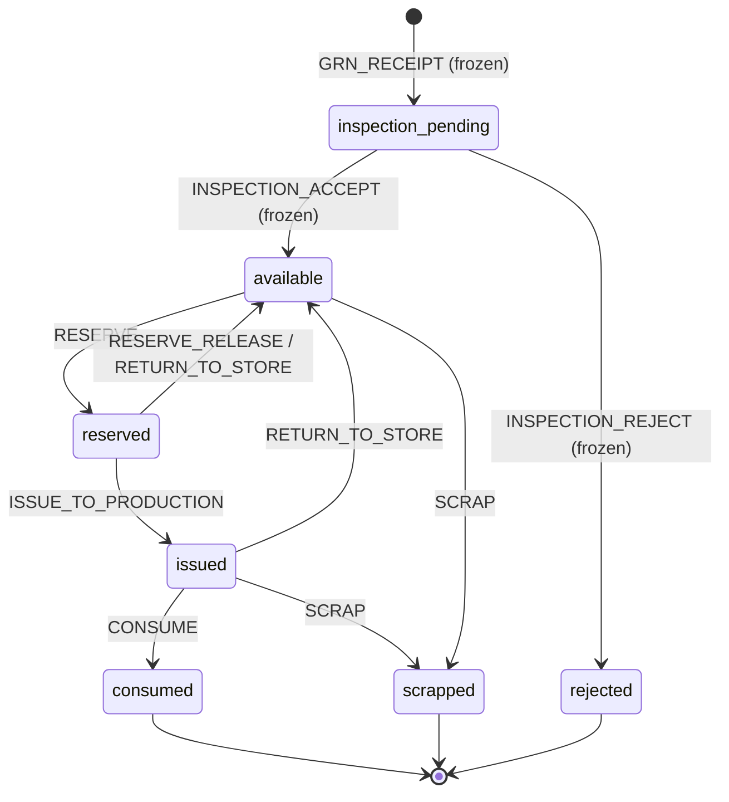

# OCS One — MES Phase 1: BOM & Material Consumption Architecture

**Status:** Design / planning only. **No code, no schema, no migration, no API.** Awaiting
CTO approval before Build Mode. Designed **on top of the now-FROZEN platforms** (Procurement,
Material/Component Master, GRN, Incoming Inspection, Unified Inventory Ledger, Product
Platform, Product Modes, Serial/Warranty Strategy, Traceability, Dispatch, Dealer) — this
module **consumes** them and redesigns nothing.

**Scope:** BOM · Material Reservation · Material Issue · Material Consumption · Material
Return · Material Scrap — for **manufactured products only**.

## Legend

🧊 FROZEN (exists, unchanged) · 🟢 ADDITIVE (new enum value on a frozen enum) ·
🆕 NEW (new table) · 🔵 DATA (rows in a frozen table).

## What already exists (consumed as-is)

- **BOM Master 🧊** — `bom_headers` (owned by **Model + `revision`**; `status`
  draft→approved→obsolete; `yield_percent`; effective dates; `UNIQUE(model_id, revision)`) and
  `bom_lines` (`material_id`, `quantity_per`, `uom`, `scrap_percent`, `is_critical_component`,
  `traceability_required`, `is_optional`, **`alternate_of_line_id`** = substitution link).
- **One signed ledger 🧊** — `inventory_transactions` (append-only; `quantity` signed;
  `stock_state`; `transaction_type`; `source_document_type/id/line_id` for genealogy). Balances
  are `SUM(quantity)` projections per material × state; nothing is ever overwritten.
- **Product Modes 🧊** (on the Model) — A Manufactured / B Purchased-OEM / C Purchased-OCS.
- **Precedent 🧊** — the existing `MATERIAL_TRANSFER_TO_CELL_PROCESSING` was named specifically
  so "future issue-to-assembly/packing/scrap transactions read clearly." Phase 1 adds exactly
  those, following the same signed idiom.

## Additive deltas Phase 1 introduces (all backward-compatible)

- 🟢 `inventory_transaction_type` += `RESERVE`, `RESERVE_RELEASE`, `ISSUE_TO_PRODUCTION`,
  `CONSUME`, `RETURN_TO_STORE`, `SCRAP`.
- 🟢 `inventory_stock_state` += `reserved`, `issued`, `consumed`, `scrapped`.
- 🆕 `mfg_order_bom_snapshot` + `mfg_order_bom_snapshot_lines` (the immutable per-order BOM copy).
- 🆕 Document headers/lines for **Issue**, **Return**, **Scrap** (house-document pattern,
  system-generated numbers), plus a **Reservation** record.
- **No change** to any frozen table, enum value, or route.

---

## The one rule that governs everything: Mode gates material flow

Material reservation/issue/consumption exist **only for Mode A (Manufactured)**. The engine's
first check is the Model's **Product Mode**:

- **Mode A (Manufactured)** — has an approved BOM, a Production Order, a BOM snapshot, and the
  full Reserve→Issue→Consume flow. **Always consumes BOM.**
- **Mode B / C (Purchased)** — **no BOM, no Production Order, no material flow.** They enter via
  GRN → Incoming Inspection and are minted as Products at `INCOMING_INSPECTION_PASS`. Any attempt
  to reserve/issue/consume against a purchased Model is **rejected (422) — fail fast**.

> This makes "purchased products never consume manufacturing BOM" a structural guarantee, not a
> convention: the material engine refuses to run for a non-manufactured Model.

---

## 1. Complete BOM Architecture (Deliverable 1)

**Ownership — Model + Revision (🧊, already enforced).** A BOM belongs to one Model at one
`revision`; `UNIQUE(model_id, revision)` prevents duplicates. Revision 1 = original; every
revision persists. An **approved** BOM is immutable — a change creates a **new revision**, never
an in-place edit.

**Lifecycle:** `draft` → `approved` → `obsolete`. Only **one** approved revision is *effective*
at a time (via `effective_from/to`); production resolves the effective approved revision.

**Line governance (🧊):** `quantity_per` (× order qty), `scrap_percent` (waste uplift),
`yield_percent` (header, required qty scales by `1/yield`), `is_critical_component`
(shortage/variance/QC alerts), `traceability_required` (serial/lot capture MANDATORY at
consume), `is_optional` (not required to complete the build), `alternate_of_line_id` (a line
that may substitute a primary).

**BOM resolution (explosion) at order release** — required qty per line:

```
required = ceil( order_qty × quantity_per × (1 + scrap_percent/100) / (yield_percent/100) )
```

**Multi-level BOM** (a line referencing a sub-assembly Model) is **out of Phase-1 scope** and
will land additively (a `bom_line_type` + `component_model_id`) per the manufacturing-model
roadmap — Phase 1 is single-level (line → material), matching the frozen schema. Composite
products (Inbuilt inverter, Home ESS) wait for that additive step; Phase 1 fully covers Battery
Pack / EV Charger / ESS single-level material consumption.

---

## 2. Material Reservation Design (Deliverable 2)

**Purpose:** soft-allocate available stock to a **released** Production Order **before**
production starts, so material is committed and shortages are caught early.

- **When:** at Production Order **release** (after the immutable BOM snapshot is taken, §BOM
  snapshot below).
- **Shortage check FIRST (fail fast):** for every snapshot line, compare `required` (§1) against
  **free available** = `SUM(@available) − SUM(open reservations)`. If any **critical** or
  non-optional line is short → **block release (422)**, list the shortfalls (material, required,
  available, gap). Optional lines and valid alternates are considered before declaring a shortage.
- **Ledger effect (signed move, 2 rows):** `RESERVE` **−qty @available**, **+qty @reserved**.
- **Release/cancel:** `RESERVE_RELEASE` **−reserved, +available** (order cancelled or
  over-reserved). Reserved stock is invisible to other orders' free-available (prevents
  double-allocation).
- **Record:** a Reservation row per order line (order, snapshot line, material, qty, status).

Reservation never leaves the ledger — it only moves `available → reserved`.

---

## 3. Material Issue Design (Deliverable 3)

**Purpose:** physically hand reserved material from Store to the shop floor.

- **When:** at (or just before) the consuming stage begins.
- **Ledger effect (signed move):** `ISSUE_TO_PRODUCTION` **−qty @reserved**, **+qty @issued**
  (`issued` = material physically on the shop floor / WIP, not yet embodied).
- **Document 🆕 (house pattern):** Issue header + lines, system number `ISS-YYYYMMDD-NNNNNN`
  (race-safe `nextval`, never client-supplied), referencing the Production Order + snapshot line.
- **Guards:** cannot issue more than reserved; `FOR UPDATE` on the material balance to prevent
  TOCTOU over-issue; Mode-A only.

Partial issues are allowed (multiple `ISS-` docs per line) until the reserved qty is drawn down.

---

## 4. Material Consumption Design (Deliverable 4)

**Purpose:** record the material actually built into the unit at a stage — the traceability
event.

- **When:** at the consuming manufacturing stage (assembly/BMS/etc.), per unit.
- **Ledger effect (signed move):** `CONSUME` **−qty @issued**, **+qty @consumed** (`consumed` =
  embodied in the finished unit; **terminal**, excluded from on-hand — so a material is never
  counted as both stock and part of a unit). This is *material* accounting; it does **not**
  create any finished-goods ledger balance (honoring the frozen "no FG ledger state" rule — the
  serialized unit lives only in the Product Platform).
- **Traceability (MANDATORY for `traceability_required` lines):** the consume call **must**
  capture the component **serial/lot** actually used; missing it → **422**. This is the data that
  becomes genealogy (§8).
- **Controlled substitution:** the consumed material may differ from the planned line **only** if
  it is a registered **alternate** (`alternate_of_line_id`) of that line; the substitution
  (planned vs actual material + reason) is recorded on the consumption event. Any other
  substitution is rejected — substitutions are controlled, never silent.
- **Variance:** consumed vs snapshot-required is captured for costing/variance (over/under-use,
  scrap).

---

## 5. Material Return Design (Deliverable 5)

**Purpose:** send unused material back to usable stock.

- **From reserved (pre-issue):** `RETURN_TO_STORE` **−reserved, +available**.
- **From issued (post-issue, leftover on the floor):** `RETURN_TO_STORE` **−issued, +available**.
- **Document 🆕:** Return header + lines, `RET-YYYYMMDD-NNNNNN`, referencing the order + the
  Issue/Reservation being unwound; **reason** recorded.
- **Guards:** cannot return more than the outstanding reserved/issued balance; `FOR UPDATE`;
  Mode-A only. Returned material re-enters `available` and is immediately reservable again.

---

## 6. Material Scrap Design (Deliverable 6)

**Purpose:** remove damaged/unusable material from stock, segregated like rejected.

- **Ledger effect:** `SCRAP` **−qty @issued** (shop-floor scrap) **+qty @scrapped**; store scrap
  is **−available, +scrapped**. `scrapped` is a **terminal, non-usable** state (mirrors
  `rejected`), excluded from on-hand and from free-available.
- **Document 🆕:** Scrap header + lines, `SCR-YYYYMMDD-NNNNNN`; **mandatory reason** (SS-03
  audit); scrap of a `is_critical_component` raises an alert.
- **Guards:** cannot scrap more than the balance in the source state; `FOR UPDATE`; Mode-A only.

Scrap is never a silent write-off — every scrapped quantity is a signed, reasoned, audited row.

---

## 7. Inventory Ledger Flow (Deliverable 7)

One ledger, every transition a **separate signed transaction type**, balances netted from
`SUM(quantity)` per state — never overwritten.



**Balance semantics**

| Bucket | States |
|---|---|
| **On-hand usable** | `available` |
| **Committed (present, spoken-for)** | `reserved` + `issued` |
| **Held** | `inspection_pending` |
| **Terminal (not on-hand)** | `consumed`, `scrapped`, `rejected` |

**Free available (for reservation & shortage)** = `SUM(@available) − SUM(open reservations)`.
Every Phase-1 move is 2 signed rows of one type (source −, destination +), exactly like the
frozen inspection `RELEASE/ACCEPT/REJECT` idiom. No move ever mutates a prior row.

**Coexistence with the frozen cell flow:** cell stock still moves Store→Cell-Processing via the
frozen `material_transfers` + `MATERIAL_TRANSFER_TO_CELL_PROCESSING` (untouched). The Phase-1
engine handles the remaining BOM materials (BMS, busbar, cable, connector, cabinet, consumables,
packaging). **Rule: any physical movement is recorded exactly once** — the engine never re-issues
a quantity the cell-transfer flow already moved (no double count).

---

## 8. Genealogy Impact (Deliverable 8)

Consumption is the bridge from material flow to **product traceability** (frozen platform).

- Each `CONSUME` for a `traceability_required` line contributes a **`product_genealogy`** row
  (component type, material, serial/lot, quantity) — the "what went into this unit" record.
- **Pre-serial WIP:** a Mode-A unit has **no official serial until QC pass** (frozen rule). So
  consumption is recorded against the **Production Order** (Phase-1 orders are 1 order → 1 unit,
  matching `products.source_production_order_id` UNIQUE), and the accumulated genealogy is
  **attached to the Product at creation** (QC pass). *(This is exactly review-decision D-2: a
  provisional order/build-unit key reconciled to the official serial at mint. If batch orders —
  1 order → N units — are ever introduced, a `build_unit_id` is the additive hook.)*
- **BOM revision + lot recorded:** the order's BOM **snapshot** revision and each consumed
  material's lot become part of the unit's permanent genealogy → warranty/recall can trace a
  defective supplier lot to every affected serial.
- **Substitutions** appear in genealogy as actual-vs-planned material, preserving truth of what
  was built.
- **Immutability:** genealogy + all ledger rows are append-only (SS-03); corrections use the ECF
  pattern, never in-place edits.

**Immutable BOM snapshot (the linchpin):** at order release, the effective approved BOM
(header + lines) is **copied** into `mfg_order_bom_snapshot(_lines)` 🆕. The Production Order
consumes **the snapshot**, never the live BOM — so **BOM revisions never affect released orders**,
and historical genealogy stays reconstructable years later.

---

## 9. Future MRP Compatibility (Deliverable 9)

Phase 1 is deliberately the seed of MRP — no redesign needed later:

- **Gross/net requirements** = BOM explosion (§1) already computes required per material.
- **Availability netting** = the reserved/available projection already gives net-available
  (free available) per material.
- **Shortage detection** (§2) is the first MRP signal; a future MRP generalizes it across the
  full order backlog and adds planned receipts (open GRNs/POs) into supply.
- **Reservations** are the demand pegging MRP consumes; **consumption variance** feeds forecast
  accuracy.
- All of it reads the **one ledger** + BOM — MRP is a *projection/planning layer*, adding no new
  source of truth and duplicating no inventory.

---

## 10. Build Plan (Deliverable 10) — phased, additive, post-approval

| Step | Scope | Additive delta |
|---|---|---|
| **P1.0 Mode gate** | material engine refuses non-Mode-A Models (fail-fast 422) | reuse Product Mode on Model |
| **P1.1 BOM snapshot** | copy effective approved BOM → immutable per-order snapshot at release | 🆕 `mfg_order_bom_snapshot(_lines)` |
| **P1.2 Explosion + shortage check** | compute required; block release on critical/non-optional shortage | engine only |
| **P1.3 Reservation** | `available → reserved`; free-available netting | 🟢 `RESERVE`, `RESERVE_RELEASE`, state `reserved` + reservation record |
| **P1.4 Issue** | `reserved → issued`; `ISS-` document | 🟢 `ISSUE_TO_PRODUCTION`, state `issued` + 🆕 issue doc |
| **P1.5 Consumption** | `issued → consumed`; mandatory serial/lot for traceable lines; controlled substitution | 🟢 `CONSUME`, state `consumed` + consumption event |
| **P1.6 Return** | `reserved/issued → available`; `RET-` document, reason | 🟢 `RETURN_TO_STORE` + 🆕 return doc |
| **P1.7 Scrap** | `issued/available → scrapped`; `SCR-` document, mandatory reason | 🟢 `SCRAP`, state `scrapped` + 🆕 scrap doc |
| **P1.8 Genealogy wiring** | consume → `product_genealogy`; attach to Product at QC pass | reuse frozen genealogy |
| **P1.9 Certification** | extend SS-02 authz-matrix + SS-03 audit + security-matrix for every new route; balance-invariant test (no negative state balance; consumed/scrapped never on-hand) | reuse cert framework |

**Standing invariants (must hold after every transaction):**
1. One signed ledger; balances are `SUM` projections, never stored/overwritten.
2. No state balance goes negative (guarded `FOR UPDATE`).
3. `consumed`/`scrapped`/`rejected` are terminal and never counted as on-hand or free-available.
4. Purchased Models (B/C) generate **zero** material transactions.
5. A released order's BOM snapshot is immutable; later BOM revisions cannot alter it.

---

## Frozen-compliance statement

This design **consumes** the frozen BOM Master, Unified Inventory Ledger, Product Platform,
Product Modes, Traceability, GRN, and Incoming Inspection **without modifying any of them**.
Every change is additive — new enum values (following the ledger's own anticipated naming), new
per-order snapshot + document tables, and an engine. It enforces all nine CTO requirements
structurally: purchased products cannot consume BOM (Mode gate); manufactured products always do;
one signed ledger; Reserve/Issue/Consume/Return/Scrap are distinct signed transactions; BOM is
owned by Model + Revision; orders receive an immutable BOM snapshot; substitutions are controlled;
shortages are detected before production; and BOM revisions never affect released orders.
No implementation begins until CTO approval and Build Mode.
