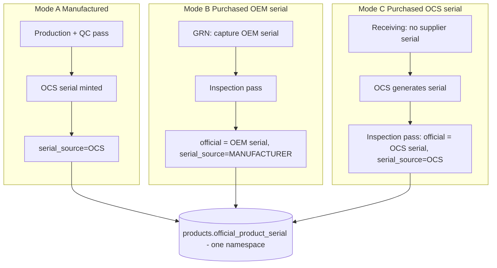
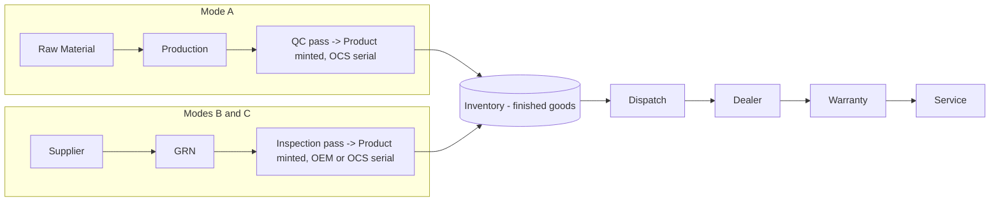
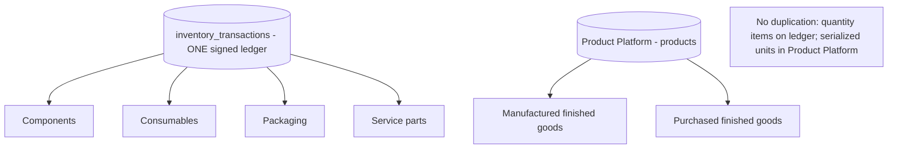
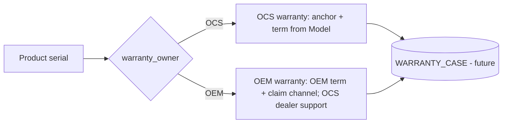
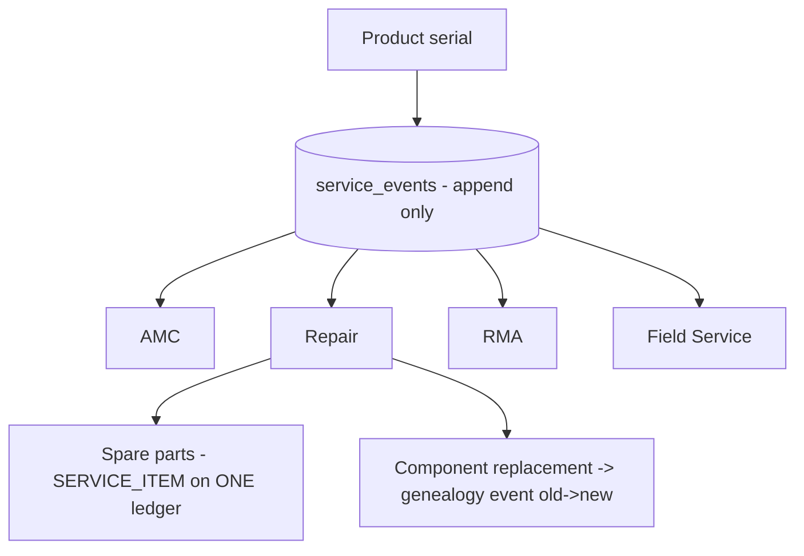

# OCS One — Product Manufacturing & Acquisition Architecture (Phase 4 Design)

**Status:** Design / planning only. **No code, no schema, no migration, no API.** Awaiting
CTO approval before Build Mode. This is the permanent foundation for **Manufacturing,
Procurement, Inventory, Warranty, and Service** — specifically the axis the manufacturing-
model design did not fully cover: **how a product enters OCS One** (built vs. imported) and
how that choice flows through serial, lifecycle, warranty, and service.

> Companion to `manufacturing-model-architecture.md` (BOM/routes/workstations/genealogy for
> *built* products) and the FROZEN `unified-product-platform-review.md`. This document adds
> the **Product Mode** dimension and reuses everything else unchanged.

## Legend

🧊 FROZEN (do not modify) · 🟢 ADDITIVE (new column/enum value on a frozen table) ·
🆕 NEW (new table/module) · 🔵 DATA (new rows in a frozen table, no schema change).

## Product families & how they enter OCS One

| # | Family | Acquisition | OEM serial? | OCS role |
|---|---|---|---|---|
| 1 | **Lithium Battery Pack** | Manufactured by OCS | — | Build + serialize + warrant |
| 2 | **Hybrid Solar Inverter** | Imported finished good | ✅ yes | Receive + resell + dealer support (OEM warranty) |
| 3 | **Lithium Inverter** | Imported finished good | ❌ none | Receive + **OCS-serialize** + warrant |
| 4 | **EV Charger** *(future)* | Manufactured (planned) | — | Build + serialize + warrant |
| 5 | **ESS** *(future)* | Manufactured (planned) | — | Build + serialize + warrant |

**The single most important design finding:** the FROZEN Product Platform **already
anticipates all three acquisition modes** — no rework, only formalization:

- `product_creation_trigger` = `QC_PASS` **|** `INCOMING_INSPECTION_PASS` — the trigger for
  imported goods already exists (HYBRID is seeded to it).
- `product_serial_source` = `OCS` **|** `MANUFACTURER` — OEM-serial provenance already exists.
- `products.source_production_order_id` is **nullable** — the schema comment states
  *"MANUFACTURER-sourced units have no OCS order."* Imported units are already representable.
- `material_usage_type` = `INVENTORY_COMPONENT | CONSUMABLE | PACKAGING | SERVICE_ITEM` —
  service parts, consumables, and packaging are already first-class inventory classes.
- `master_products.warranty_period_months` already lives on the Model master.

---

## 1. Product Modes

A **Product Mode** classifies the acquisition + lifecycle path of a Model. It is the single
switch that determines whether a Product has a BOM/route, when its Product record is minted,
and where its serial and warranty come from.

**🟢 additive `product_mode` enum, declared on the Workflow** (the Workflow already decides
*when* a Product is minted via `product_creation_trigger`, so Mode belongs with it):

| Mode | Family example | Creation trigger | Serial source | BOM/Route? | Warranty owner |
|---|---|---|---|---|---|
| **A · MANUFACTURED** | Battery Pack, EV Charger, ESS | `QC_PASS` | `OCS` | ✅ yes | OCS |
| **B · PURCHASED_OEM_SERIAL** | Hybrid Inverter | `INCOMING_INSPECTION_PASS` | `MANUFACTURER` | ❌ no | OEM (+ optional OCS dealer support) |
| **C · PURCHASED_OCS_SERIAL** | Lithium Inverter | `INCOMING_INSPECTION_PASS` | `OCS` | ❌ no | OCS |

**Mode = (creation trigger, serial source, has-route).** It is a *declared classification*
consistent with the existing enums, not a competing concept — so an existing HYBRID workflow
already resolves to Mode B, and BATTERY to Mode A, with zero data conflict.

### Product Mode Matrix (Deliverable 2)

| Capability | A Manufactured | B Purchased/OEM serial | C Purchased/OCS serial |
|---|---|---|---|
| BOM | ✅ | ❌ | ❌ |
| Production Order | ✅ | ❌ | ❌ |
| Material Consumption | ✅ | ❌ | ❌ |
| Manufacturing Route | ✅ | ❌ | ❌ |
| GRN | for its raw materials | ✅ (the finished good) | ✅ (the finished good) |
| Incoming Inspection | for its raw materials | ✅ | ✅ |
| Product minted at | QC pass | inspection pass | inspection pass |
| Serial origin | OCS-generated | OEM (captured) | OCS-generated at receiving |
| `source_production_order_id` | set | NULL | NULL |
| Full build genealogy | ✅ | ❌ | ❌ |
| Supplier traceability genealogy | for raw materials | ✅ | ✅ |
| Inventory | ✅ | ✅ | ✅ |
| Dispatch → Dealer | ✅ | ✅ | ✅ |
| Warranty | OCS | OEM (+dealer) | OCS |
| Service | ✅ | ✅ | ✅ |

---

## 2. Serial Number Strategy

One **official serial per unit**, one global uniqueness namespace
(`products.official_product_serial` UNIQUE 🧊). What differs by Mode is **origin and timing**.

| Family | Serial | Source flag | Generated / captured when |
|---|---|---|---|
| Battery Pack | OCS Battery Serial | `OCS` | at **QC pass** (Product minted) |
| Hybrid Inverter | **OEM serial** (as-is) | `MANUFACTURER` | **captured at GRN**, validated + promoted to official at **inspection pass** |
| Lithium Inverter | **OCS-generated** serial | `OCS` | **generated at receiving/inspection**, official at **inspection pass** |
| EV Charger / ESS *(future)* | OCS Product Serial | `OCS` | at QC pass (manufactured) |

**🆕 `serial_policies`** (data, additive) — per-Family/Model pattern
(prefix + date + sequence + check digit), sequence-backed by the same race-safe `nextval`
pattern already used for `mfg_order_seq` / `dispatch_seq`. OEM-serial modes skip generation
and store the supplier value.

- **Generation timing** — Mode A: QC pass. Modes B/C: incoming-inspection pass. Never before
  the Product's gate (permanent rule: *no Product before its trigger*).
- **Uniqueness** — a single global namespace. OEM serials are validated for collision on
  insert (UNIQUE → 409); a per-source prefix policy prevents two OEMs colliding.
- **Warranty ownership** — the serial is the warranty key. OCS serials → OCS warranty
  entitlement; OEM serials → OEM warranty (OCS holds dealer-support context).
- **Service ownership** — the serial is the service key: every RMA/repair/replacement is
  keyed to it regardless of Mode.
- **Traceability** — the serial roots the genealogy (build genealogy for A; supplier
  traceability for B/C). It never changes or renumbers once minted.

### Serial Number Architecture (Deliverable 4)



---

## 3. Product Life Cycle (Deliverable 3)

Two entry paths converge at Inventory and share the identical downstream chain.



Downstream (Inventory → Dispatch → Dealer → Warranty → Service) is **mode-agnostic** — every
module keys off the serialized Product, never off how it was acquired. This is why the frozen
Dispatch/Dealer/Product-Inventory modules already work for imported goods with no change.

---

## 4. Inventory Model — one ledger, no duplication (Deliverable 7)

**Principle: every item has exactly ONE source of truth. Nothing is counted twice.**

| Item class | Source of truth | Mechanism |
|---|---|---|
| Raw materials / **Components** | `inventory_transactions` ledger 🧊 | signed rows, `material_usage_type = INVENTORY_COMPONENT` |
| **Consumables** | same ledger 🧊 | `material_usage_type = CONSUMABLE` |
| **Packaging** | same ledger 🧊 | `material_usage_type = PACKAGING` |
| **Service parts / spares** | same ledger 🧊 | `material_usage_type = SERVICE_ITEM` |
| **Manufactured finished goods** | Product Platform (`products`) 🧊 | serialized unit; availability = `product_status` projection |
| **Purchased finished goods** (B & C) | Product Platform (`products`) 🧊 | serialized unit minted at inspection pass |

There is **no second inventory system**: quantity-tracked items live on the single signed
ledger; serialized finished units live in the Product Platform. Finished-goods "stock" is a
**read-only projection** over `product_status` (the frozen *Product Inventory* module already
does exactly this). The two never overlap — a material is never also a product row, and a
product is never also a ledger balance.



---

## 5. Warranty Model (Deliverable 5)

**🟢 additive `warranty_owner` enum** as a *Warranty Strategy* on the Model master
(alongside the existing `warranty_period_months` 🧊):

| Family | Warranty owner | Term | Key |
|---|---|---|---|
| Battery Pack | `OCS` | `warranty_period_months` | OCS serial |
| Hybrid Inverter | `OEM` (+ optional OCS dealer support) | OEM term (captured) | OEM serial |
| Lithium Inverter | `OCS` | `warranty_period_months` | OCS-generated serial |
| EV Charger / ESS *(future)* | `OCS` | `warranty_period_months` | OCS serial |

- **Warranty start anchor** = `products.manufacturing_completed_at` 🧊 — already documented as
  the permanent reference for warranty start and ageing. For **purchased** modes this column
  is populated with the **inspection-pass timestamp** (the unit's "available since"). *(Naming
  observation: the column semantically means "available since"; keep it as the single anchor,
  document the dual semantics — do not rename, that would break the frozen contract.)*
- **OEM warranty** stores the OEM term + claim channel; OCS provides dealer-facing support but
  the warranty obligation is the OEM's.
- **OCS warranty** (Modes A & C) is entitlement-checked from serial + anchor + term.
- `ecf_entity_type` already reserves `WARRANTY_CASE` for the future warranty module.

### Warranty Architecture



---

## 6. Service Model (Deliverable 6)

A single service layer over the serialized Product, mode-agnostic and **append-only** (never
mutates manufacturing genealogy or the ledger).

**🆕 `service_events`** (append-only per Product, mirrors `product_events`) + reuse of the
frozen ledger for spare parts (`SERVICE_ITEM`) and the ECF pattern for part swaps.

| Capability | Design |
|---|---|
| **AMC / contracts** | contract references the Product serial; coverage window from the warranty anchor |
| **Repair** | `service_events` entry: symptom → diagnosis → action → technician → centre |
| **Replacement** | issue a replacement Product (new serial), link old→new on both units' timelines |
| **RMA** | return authorization keyed to serial; returned unit re-enters as a controlled state (no silent stock overwrite) |
| **Field Service** | mobile-friendly read of serial → genealogy + service history |
| **Service Centres** | centre master + assignment on `service_events` |
| **Spare Parts** | `SERVICE_ITEM` materials on the ONE ledger; consumed at repair with genealogy linkage |

### Service Architecture



---

## 7. Product Master (Deliverable 8)

Consolidated master design — where each attribute lives and what owns it.

| Attribute | Meaning | Home | State |
|---|---|---|---|
| **Product Family** | broadest grouping (Battery / Inverter / EV / ESS) | `product_categories` (or a Family above Category) | 🧊 / 🔵 |
| **Product Category** | sub-grouping within a Family | `product_categories` | 🧊 |
| **Product Model / SKU** | specific design; costing/BOM/warranty owner | `master_products` | 🧊 |
| **Revision** | engineering version of a Model | `master_product_revisions` | 🆕 |
| **Variant** | configuration option of a Model | `master_product_variants` | 🆕 |
| **Product Mode** | A Manufactured / B Purchased-OEM / C Purchased-OCS | Workflow (`product_mode`) | 🟢 |
| **Serial Strategy** | source + generation timing + pattern | `serial_source` 🧊 + `serial_policies` 🆕 | 🟢/🆕 |
| **Warranty Strategy** | owner + term | `warranty_period_months` 🧊 + `warranty_owner` 🟢 | 🟢 |
| **Manufacturing Strategy** | route + creation trigger (or "none" for purchased) | Workflow (`stage_sequence`, `product_creation_trigger`) | 🧊 |

**Ownership rule:** the **Model** owns BOM, warranty term, and serial/warranty strategy; the
**Workflow** owns Mode, route, and creation trigger; the **Category/Family** owns the route
archetype and serial-policy defaults; the **serialized Product** derives everything and adds
nothing that competes with its masters.

---

## 8. Genealogy by Mode

The frozen `product_genealogy` (free-text `component_type`) + `product_events` already
generalize to both paths — no new genealogy store is needed.

| Mode | Genealogy content |
|---|---|
| **A Manufactured** | **full build genealogy** — components/serials/lots, operator/machine/shift/fixture/firmware, BOM & material revision, test/inspection/QC reports (see `manufacturing-model-architecture.md` §6) |
| **B & C Purchased** | **supplier traceability** — supplier, GRN number, incoming-inspection result, OEM/OCS serial, then dealer assignment, warranty entitlement, and service events |

Both converge on the same downstream timeline: dispatch → dealer → warranty → service events
append to `product_events` regardless of Mode.

---

## 9. Future Expansion (Deliverable 9)

Every future family maps onto an **existing Mode** — no redesign, only master data + (for
manufactured families) a BOM/route:

| Family | Mode | What's needed |
|---|---|---|
| Solar Inverters (imported) | B or C | Category/Model rows + supplier; reuse GRN→inspection→Product |
| Battery Packs | A | already built |
| Lithium Inverters | C | Category/Model rows + OCS serial policy |
| EV Chargers | A | Category/Model + BOM + route (manufacturing-model doc) |
| ESS | A | Category/Model + BOM + route + (composite assemblies if needed) |

Because Mode is a declared classification over enums that already exist, adding a family is
**data + optional BOM/route**, never a schema redesign.

---

## Future Expansion Roadmap

| Phase | Scope | Depends on |
|---|---|---|
| **PA.1 Product Mode** | `product_mode` on Workflow; classify existing BATTERY=A, HYBRID=B, add Lithium=C | Product Platform 🧊 |
| **PA.2 Purchased-product creation** | wire `INCOMING_INSPECTION_PASS` handler to mint Products from an inspection-passed finished-good GRN line (B & C); OEM-serial capture at GRN | GRN + Inspection 🧊, PA.1 |
| **PA.3 Serial policies** | `serial_policies` per Family/Model; OCS generation for A & C; OEM capture for B | PA.1 |
| **PA.4 Warranty strategy** | `warranty_owner` on Model; warranty entitlement service; `WARRANTY_CASE` module | PA.1–PA.3 |
| **PA.5 Service layer** | `service_events`, RMA, spare parts (SERVICE_ITEM), component replacement via ECF | Warranty |
| **PA.6 Manufacturing depth** | BOM/routes/workstations for A families (per `manufacturing-model-architecture.md` roadmap) | manufacturing-model design |
| **PA.7 New families** | EV Charger, ESS, Solar Inverter as data on existing Modes | all above |

---

## Frozen-compliance statement

This design **consumes** the FROZEN Unified Product Platform, inventory ledger, GRN,
Incoming Inspection, ECF, and SS-01/02/03/04 **without modifying any of them**. Every
proposed change is **additive** (new enum values, columns, tables, or data). It confirms and
formalizes what the platform already reserved — the `INCOMING_INSPECTION_PASS` trigger, the
`MANUFACTURER` serial source, the nullable order link, `SERVICE_ITEM` inventory, and
`WARRANTY_CASE` — so imported products (Hybrid & Lithium inverters) and future families are
supported with **no redesign**. No implementation begins until CTO approval and Build Mode.
```
