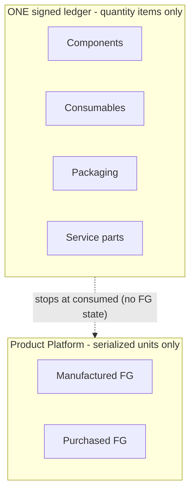

# OCS One — Product Platform Final Architecture Review (Pre-Freeze CTO Validation)

**Status:** Architecture validation only. **No code, no schema, no migration, no API.**
This is the final CTO review of the complete Product Platform (the FROZEN v1.0 core +
`manufacturing-model-architecture.md` + `product-acquisition-architecture.md`) against real
factory operations, before the Product Platform Freeze.

**Verdict up front:** the platform is **sound and conditionally ready to freeze**. The
taxonomy, boundaries, and lifecycle are correct and scale to every named future product.
Three small, additive-compatible decisions must be closed first (§9); none forces a redesign.

## Architecture Score — 88 / 100 (A−), conditional GO

| Dimension | Score | Note |
|---|---|---|
| Product Modes (taxonomy) | 9/10 | A/B/C cover all serialized hardware; bundle/kit is a sales-layer gap, not a mode gap |
| Serial strategy | 8/10 | canonical serial is right; **pre-QC WIP identity** and barcode/QR-as-encoding need locking |
| Warranty ownership | 9/10 | owner-on-Model is right; separate *obligation owner* from *support owner* |
| Inventory ownership | 8/10 | boundary is correct, but the proposed `finished_goods`/`FG_RECEIPT` ledger state **double-counts** serialized units |
| Product Master ownership | 8/10 | Mode/Serial/Warranty belong on the **Model**, not the Workflow (refine prior placement) |
| Service readiness | 9/10 | mode-agnostic over the serial; OEM claim channel is additive |
| Future scalability | 9/10 | all named products fit; configure-to-order (large ESS) is the only stress point |
| Freeze readiness | 8/10 | freeze taxonomy + boundaries now; 3 open decisions to close first |

---

## 1. Product Modes — are three enough?

**A** Manufactured (Battery/EV/ESS) · **B** Purchased w/ OEM serial (Hybrid Inverter) ·
**C** Purchased w/o OEM serial → OCS generates at inspection (Lithium Inverter).

**Finding: YES for serialized hardware — the three modes are sufficient.** Every physical,
individually-serialized product OCS acquires is either *built by OCS* (A) or *bought
finished* (B if the vendor serializes, C if not). This is a complete partition of the
acquisition axis.

**Two things that look like new modes but are NOT — and the recommendation for each:**

1. **Composite / assembled products** (Inbuilt Lithium Inverter = Hybrid + Battery Pack;
   Home ESS = battery + inverter + cabinet) are **Mode A** — they *are* manufactured (their
   "route" is final integration + combined testing), consuming child serialized units via a
   multi-level BOM. No new mode. ✅
2. **Bundle / Kit** (multiple *independently* serialized units sold and shipped together
   under one sales SKU, never physically integrated) is **not a Product Mode** — it is a
   **sales/packaging construct**. Recommend a future additive **`product_bundles`** concept
   at the order/dispatch layer that references N serialized Products, rather than a Mode D.
   Forcing kits into a product mode would corrupt the "one serial = one unit" invariant.

**Refurbished / RMA re-entry** is also *not* a new mode — a returned unit keeps its original
serial and re-enters through the **service lifecycle** (a controlled re-entry state), not a
new acquisition. Handle in the Service module (§6).

**Recommendation:** keep exactly **three acquisition modes**; add **Bundle** as a sales-layer
concept (future, additive) and **Refurb re-entry** as a service state (future, additive).

---

## 2. Serial strategy — ownership, timing, mutability, multiplicity

| Mode | Who generates | When | Can it change? |
|---|---|---|---|
| A Manufactured | **OCS** (serial policy) | at **QC pass** | never |
| B Purchased/OEM | **OEM** (captured as-is) | captured at GRN, promoted to official at **inspection pass** | never |
| C Purchased/OCS | **OCS** (serial policy) | generated at **receiving/inspection**, official at inspection pass | never |

**Should multiple serials exist? — One *canonical* serial, many *labels*.** Best practice:

- **Official Product Serial** — the single immutable business key (`official_product_serial`
  🧊). Exactly one per unit, one global namespace. For Mode B this *is* the OEM serial.
- **Barcode / QR** — **encodings** of the official serial, generated for scanning. Do **not**
  store them as separate identities (that would create shadow serials). Print/derive on demand.
- **Internal Tracking Number** — needed **before** the official serial exists. **Critical
  gap:** a Mode-A unit has *no serial for its entire build* (permanent rule: no Product
  before QC pass), yet consumption, genealogy, and rework happen during the build. It needs a
  **provisional build-unit id** (order + build-position) that is **reconciled to the official
  serial at QC pass**. Without it, in-process traceability has no stable unit key (see Risk
  H-2).
- **Service Number** — an RMA/case id in the **service layer**, keyed to the serial. Not a
  product identity.

**Recommendation:** lock the **one-canonical-serial + labels** model. If external identifiers
ever proliferate (customer asset tags, alternate OEM serials), add an additive
**`product_identifiers`** alias table (type, value, `is_primary`) — but the official serial
stays the single primary and never changes. Enforce **source-scoped uniqueness** so two OEMs
cannot collide on the same serial string (Risk M-4).

---

## 3. Warranty ownership — cleanest architecture

| Product | Warranty obligation | Support responsibility |
|---|---|---|
| Battery | **OCS** | OCS |
| Hybrid Inverter | **OEM** | **OCS dealer** (assists, does not own the obligation) |
| Lithium Inverter | **OCS** | OCS |
| Future (EV/ESS) | **OCS** | OCS |

**Cleanest architecture — separate three layers:**

1. **Warranty *strategy* on the Model** (design property, stable): `warranty_owner`
   (`OCS | OEM`), `warranty_period_months` (🧊, already present), claim channel.
2. **Warranty *instance* derived on the Product**: start = the *available-since* anchor
   (`manufacturing_completed_at`), end = start + term. Materialize only when a claim opens.
3. **Separate "obligation owner" from "support owner."** Conflating them (as
   `OEM_PLUS_OCS_DEALER` did in the acquisition draft) is a smell: the OEM *owns* the Hybrid
   warranty; OCS merely provides dealer support. Model these as **two orthogonal fields**
   (`warranty_owner` + `ocs_dealer_supported` / `support_owner`) so a report can always answer
   "who pays" vs. "who the dealer calls." (Risk M-3.)

**Recommendation:** warranty **policy on Model**, **instance on Product**, obligation vs
support kept orthogonal. For OEM goods, allow a **per-unit term override** (OEM terms can
differ per shipment).

---

## 4. Product Master ownership — what should it own?

**Finding — refinement of the acquisition draft (which placed Mode on the Workflow):**

| Attribute | Correct owner | Why |
|---|---|---|
| **Product Mode** | **Model** (with Category default) | acquisition is intrinsic to *what the product is*; it never changes per manufacturing run, and purchased goods (B/C) have no real manufacturing workflow — forcing a Workflow row just to carry a trigger is a smell |
| **Serial Strategy** | **Model** (pattern default from Category/Family) | a Model always has the same serial origin |
| **Warranty Strategy** | **Model** | warranty is a product-design property |
| **Manufacturing Strategy** (route, creation trigger) | **Workflow** (Mode A only) | the *process* can evolve independently and be shared across Models; it exists only for manufactured products |

**The clean separation:** the **Model (Product Master) owns what the product IS** — Mode,
serial strategy, warranty strategy. The **Workflow owns how a manufactured product is MADE**
— route + creation trigger — and exists **only for Mode A**. For Modes B/C the creation
trigger is *implied by Mode* (`PURCHASED ⇒ INCOMING_INSPECTION_PASS`); no Workflow required.

This **refines** `product-acquisition-architecture.md` §1/§7, which put `product_mode` on the
Workflow. Moving Mode to the Model removes the "phantom workflow for purchased goods" problem
and keeps the Product Platform's separation of concerns intact. (Risk M-1.)

---

## 5. Inventory ownership — is there duplication?

**Boundary is correct:** raw materials/consumables/packaging/service-parts → the single
`inventory_transactions` ledger (via `material_usage_type`); serialized finished goods → the
Product Platform (`products`, availability = `product_status` projection).

**But — the manufacturing-model draft's proposed `finished_goods` stock-state +
`FG_RECEIPT` ledger transaction WOULD create duplication.** A serialized unit would then be
counted **twice**: once as a `finished_goods` ledger balance and once as a `products` row.
That violates the "no duplicate inventory" invariant the CTO asked to confirm.

**Resolution (Risk H-1):** the material ledger **stops at `consumed`** (material value is
embodied in the unit). **Do not add `finished_goods`/`FG_RECEIPT` to the ledger.** Serialized
finished goods live **only** in the Product Platform. A `wip` accounting state is optional for
costing but must be a *value* view that nets against `consumed`, never a second count of units.

With that one correction, the boundary is clean and duplication-free:

**Recommendation:** confirm the ledger owns quantity items **up to consumption**; the Product
Platform owns serialized units; there is **no** finished-goods ledger state. Then, and only
then, is there provably no duplication.

---

## 6. Service readiness — Battery / Hybrid / Lithium without redesign?

**Yes.** Service keys off the **serial**, which every mode has. The genealogy content differs
(full build for A; supplier traceability for B/C) but the **`service_events` timeline is
mode-agnostic**. Warranty routing differs by owner:

- **OCS-warranty** (Battery, Lithium, future) → OCS service centre + OCS spare parts
  (`SERVICE_ITEM` on the ledger) + component replacement via genealogy events.
- **OEM-warranty** (Hybrid) → the *same* service intake, but claims route to the **OEM claim
  channel** (an additive channel field, not a redesign); OCS provides dealer support.

RMA re-entry, replacement (new serial linked old→new), and field service all sit on the same
serial-keyed model. **No redesign required** — only additive channel/centre configuration.

---

## 7. Future products — scalability without redesign?

| Product | Fits mode | Note |
|---|---|---|
| Solar PCU | A (built) or B/C (imported) | straightforward |
| UPS | B/C (imported) or A | straightforward |
| Home ESS | A (composite) | battery + inverter + cabinet via multi-level BOM |
| Industrial ESS | A (composite) | **configure-to-order** stress point (see below) |
| Power Banks | A or B/C | straightforward |
| E-Rickshaw Battery | A | like a battery pack |

**All named products fit the three modes with data + (for A) a BOM/route — no redesign.**

**One genuine stress point (Risk M-2): configure-to-order / project products** (large
Industrial ESS where each unit is a bespoke configuration). The current model assumes
*Model → BOM*. Bespoke units need a **per-order BOM override** (an order-level BOM snapshot
that can deviate from the Model's standard BOM). This is **additive** (the order already
snapshots its BOM revision — allow that snapshot to be edited pre-release) and does not affect
the freeze.

---

## 8. Risk Matrix

| ID | Risk | Sev | Solution |
|---|---|---|---|
| **H-1** | `finished_goods`/`FG_RECEIPT` ledger state double-counts serialized units (violates "no duplication") | **High** | Ledger stops at `consumed`; finished goods live only in Product Platform; drop the FG ledger state |
| **H-2** | Mode-A units have **no serial during build** (no stable WIP identity for consumption/genealogy/rework) | **High** | Provisional **build-unit id** (order + build position), reconciled to the official serial at QC pass |
| **M-1** | `product_mode` placed on Workflow forces a "phantom workflow" for purchased goods | Medium | Move Mode (and serial/warranty strategy) to the **Model**; Workflow is Mode-A-only |
| **M-2** | Configure-to-order products (Industrial ESS) need per-unit BOM, not per-model | Medium | Allow an editable **per-order BOM snapshot** (additive) |
| **M-3** | Warranty "obligation owner" conflated with "support owner" (`OEM_PLUS_OCS_DEALER`) | Medium | Two orthogonal fields: `warranty_owner` (OCS/OEM) + `support_owner`/`ocs_dealer_supported` |
| **M-4** | OEM serials from different vendors could collide in one global namespace | Medium | Source-scoped uniqueness / per-source prefix policy |
| **M-5** | `manufacturing_completed_at` is semantically "available-since" for purchased goods (naming mismatch) | Medium | Keep as the single anchor; document dual semantics; optional read-alias view (never rename — frozen contract) |
| **L-1** | Barcode/QR could be stored as shadow serials | Low | Treat as **encodings** of the official serial, generated not stored |
| **L-2** | Refurb/RMA re-entry could be mistaken for a new acquisition mode | Low | Handle as a **service re-entry state**, reuse the original serial |
| **L-3** | Spare part sold standalone may need its own serial/warranty | Low | If sold as a unit, mint it as a Mode-A/B/C Product; otherwise it stays a `SERVICE_ITEM` |

No **Critical** risks — nothing forces a redesign or blocks the freeze.

---

## 9. Build readiness & Freeze recommendation

**Recommendation: CONDITIONAL FREEZE — GO.** Freeze the taxonomy and boundaries now; close
three small decisions (all additive-compatible) before writing code.

### Freeze permanently (stable, no foreseeable change)

1. **Three acquisition modes** A / B / C as the complete serialized-hardware taxonomy.
2. **One canonical `official_product_serial`** — immutable, single global namespace, one per
   unit; `serial_source` (OCS | MANUFACTURER) as provenance only.
3. **Inventory boundary** — one signed ledger for quantity items (up to **consumption**);
   Product Platform for serialized units; **no finished-goods ledger state** → no duplication.
4. **Two lifecycles converging at inventory**, mode-agnostic downstream (Dispatch → Dealer →
   Warranty → Service).
5. **Product Master (Model) owns what the product IS** (Mode, serial strategy, warranty
   strategy); **Workflow owns how a Mode-A product is MADE** (route, creation trigger).
6. **Service keyed to the serial**, append-only; spares as `SERVICE_ITEM` on the one ledger.
7. **Composite products are Mode A** via multi-level BOM (no special composite schema).

### Close before code (3 decisions — all additive, none re-architects)

- **D-1 (from H-1):** confirm the ledger has **no** finished-goods state (drop FG_RECEIPT).
- **D-2 (from H-2):** approve a **provisional build-unit id** for Mode-A WIP, reconciled at
  QC pass.
- **D-3 (from M-1/M-3):** move **Mode/serial/warranty strategy to the Model**, and split
  **warranty obligation vs support owner**.

### Safe to defer (future, additive — do NOT block the freeze)

Bundle/Kit (sales layer), configure-to-order per-order BOM, refurb/RMA re-entry state,
`product_identifiers` alias table.

---

## 10. Future recommendations

1. **Ship the three closed decisions (D-1..D-3) as the first Build-Mode tasks** — they are the
   only pre-code architecture work.
2. **Sequence implementation** per the acquisition roadmap (PA.1 Mode → PA.2 purchased-product
   creation → PA.3 serial policies → PA.4 warranty → PA.5 service), interleaved with the
   manufacturing roadmap for Mode-A depth.
3. **Prove the boundary with a test** (SS-style): assert no serialized unit ever appears as a
   ledger balance and no material ever appears as a Product — a standing invariant check.
4. **Add Bundle and configure-to-order only when a real product needs them** (commercial-
   readiness discipline) — the architecture already leaves clean, additive seams for both.

**Bottom line:** the Product Platform is architecturally sound, scales to every named future
product without redesign, and is ready to be **frozen after D-1..D-3 are ratified**. Score
**88/100 (A−)** — a conditional GO to freeze.
